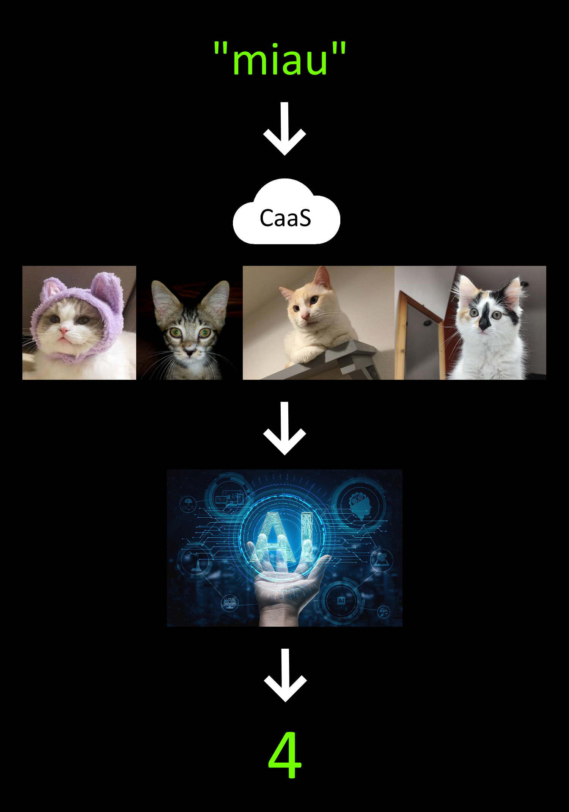

# Length of string

This is the modern way to calculate the length of a string.

It uses **Cat as a Service** and **Artificial Intelligence**.

[Read more in this article](https://medium.com/@happybits/length-of-a-string-the-easy-way-f726f7cd3fa4)

Here is the process:

